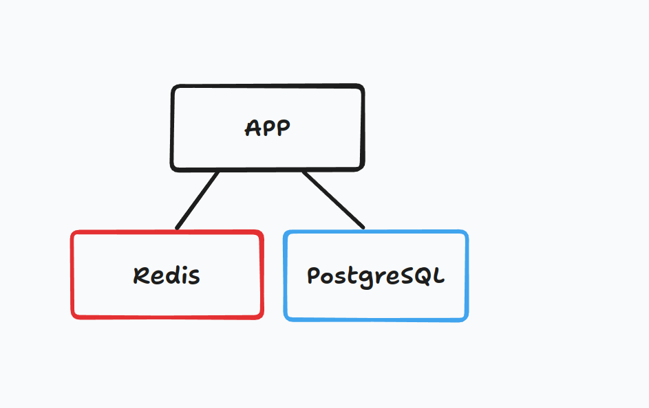

# Simple Go HTTP Server

This project is a minimal HTTP server written in Go. It listens on port 8080 and responds with a JSON object.

## Endpoints

GET - Ping: `/ping`

```json
{
    "ping": "pong"
}
```

GET - Person: `/person/{id}` \
Read person from Redis with id

```json
{
    "id": 1,
    "name": "John Doe"
}
```

POST - Person: `/person` \
`/person` endpoint receives a JSON object with an `id` field and returns a JSON object with an `id` and a `name` field.

* Read person from PostgreSQL with id
* Set person to Redis

```json
{
    "id": 1,
}
```

## Usage

From DockerHub:

```bash
docker run -p 8080:8080 realtemirov/simple-server
```


